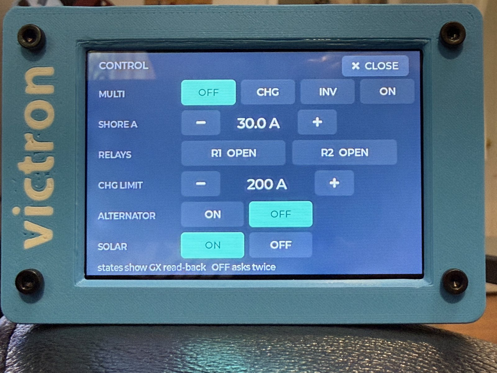
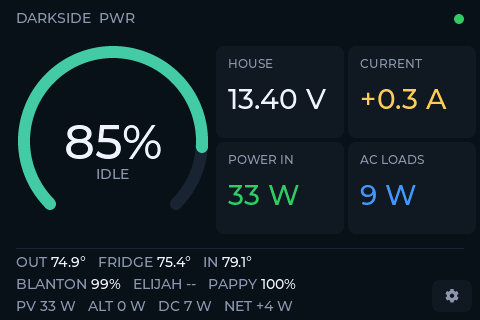
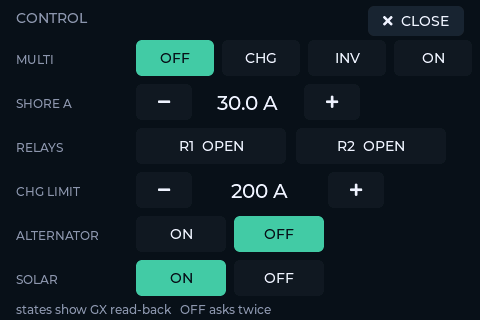

# Darkside PWR

Victron power monitor in the DSODash design language, for the ELECROW
CrowPanel Advance 3.5" (ESP32-S3, 480×320 ILI9488 SPI, GT911 touch).
Polls a Victron GX device (Ekrano) over **Modbus TCP** on the local
network — no BLE keys, no cloud, works anywhere the truck is.




**Flash it from your browser — no toolchain:**
[patrickdarke.github.io/DarksidePWR](https://patrickdarke.github.io/DarksidePWR/)
(Chrome/Edge; provision Wi-Fi and the GX on the touchscreen afterwards).

**Docs:** [Setup Guide](SETUP.md) (GX config → flash → provision) ·
[User Guide](USERGUIDE.md) (every screen element, setup menu, control
page, telemetry).

**Case:** [`case/`](case/) has a print-ready 3MF (Bambu Studio project)
and the STEP source (Shapr3D) for a 3.5" panel enclosure — that's it in
the photo above.

## Data path

`gx_poller.cpp` reads unit **100** (`com.victronenergy.system`) on port 502,
registers verified live against the Darkside.Overland Ekrano (2026-07-24):

| Register | Meaning | Scale |
|---|---|---|
| 840 | Battery voltage | ÷10 V |
| 841 | Battery current (signed) | ÷10 A |
| 842 | Battery power (signed) | W |
| 843 | State of charge | % |
| 844 | Battery state | 0 idle · 1 charging · 2 discharging |
| 850 | PV (DC-coupled) power | W |
| 817 | AC consumption L1 | W |
| 860 | DC system power | W |

The Orion XS alternator, temperature sensors, and tank senders are read as
separate per-device units, non-fatally (a napping sensor shows `--`). Unit
ids, labels, list lengths, and °F/°C (`TEMPS_IN_F`) are all `config.h`
settings — any temperature/tank service the GX knows works, Ruuvi and Mopeka
are just what this truck runs. Full verified register map in `CLAUDE.md`.
The header title auto-pulls the GX system name (VRM installation name,
register 5700) unless `UI_TITLE` in `config.h` pins a fixed one.

GX prerequisites (Settings → Integrations): **Modbus TCP Server = Enabled**.
Addressing: `venus.local` via mDNS, falling back to the pinned IP in
`config.h` (keep a DHCP reservation for the GX).

## Building

One-time: `cp secrets.h.example secrets.h`. Editing it is largely optional —
the gear button (lower right) opens an on-device setup screen for Wi-Fi
(scan, pick, type the password on-screen), the GX address, °F/°C, and
brightness; everything saves to NVS and overrides the config.h defaults at
boot. secrets.h (gitignored) holds only Wi-Fi credentials.

```
./build.sh          # compile
./build.sh flash    # compile + flash the attached usbmodem port
```

`lib/` vendors the display stack: LVGL 8.3.11 (ELECROW's copy + their
`lv_conf.h`) and LovyanGFX 1.2.26 — deliberately newer than the vendor's
1.1.16, which does not compile against esp32 core 3.3.10 / IDF 5.5.
`LovyanGFX_Driver.h` is their lesson-03 panel config for board revisions
V1.2–V1.4, unmodified.
Vendor source: github.com/Elecrow-RD/CrowPanel-Advance-3.5-HMI-ESP32-S3-AI-Powered-IPS-Touch-Screen-480x320

## Status

Working: Wi-Fi + 1 Hz Modbus poll + the power screen — SOC arc, house V,
battery A, POWER IN (PV + Orion XS alternator), AC loads, Ruuvi temps line,
Mopeka LPG tanks line (red when low), PV/ALT/DC/NET footer, link dot — plus
a touch setup screen (gear button: Wi-Fi scanner/picker, on-screen keyboard,
credentials in NVS, brightness slider with PWM dimming), a CONTROL page
(bolt button: MultiPlus mode + shore limit, GX relays, DVCC charge limit,
solar charger on/off,
alternator on/off — with read-back state and a confirm step on OFF),
**tap-any-tile 24 h history charts** (per-minute recording; FFat snapshots
survive reboots, and an optional TF card gets a daily per-minute CSV), an
SNTP wall clock, and a charge-complete chirp. Ideas next: sensor-detail
second page (humidity/pressure, Orion detail), low-SOC alert.


