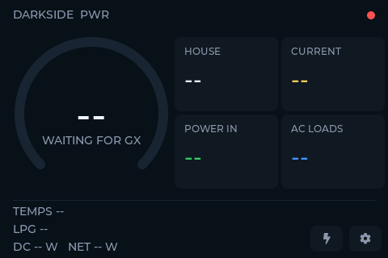

# Darkside PWR — Setup Guide

From zero to a live panel. Times assume a working Victron system; the
firmware side is ~15 minutes.

## What you need

- **ELECROW CrowPanel Advance 3.5"** (ESP32-S3-WROOM-1-N16R8, 480×320
  ILI9488, GT911 touch), board revision V1.2–V1.4, and a USB-C cable.
- A **Victron GX device** (Ekrano, Cerbo, …) on the same Wi-Fi network the
  panel will use. Venus OS 3.x.
- Optional per sensor type: Orion XS alternator charger, temperature
  sensors (Ruuvi or wired), tank senders (Mopeka or resistive) — anything
  the GX already shows works.
- A Mac/Linux box with `arduino-cli` for the one-time flash (or skip it
  entirely with the web flasher — see below).
- Optional: a 3D-printed case — `case/` in the repo has the print-ready
  3MF and the STEP source.

## 1. Configure the GX

1. **Settings → Integrations → Modbus TCP Server → Enabled.** That's the
   whole data path — port 502, no auth, LAN only.
2. Recommended: give the GX a **DHCP reservation** so its IP never moves,
   and put that IP in `config.h` as the fallback. mDNS (`venus.local`)
   works on the same LAN segment but not across routed subnets.

## 2. Find your device unit ids

Modbus unit id = the device instance shown in brackets in the VRM device
list (e.g. "Temperature sensor [22]" → unit 22). You need:

- **Alternator** (Orion XS): one unit id (`GX_ALT_UNIT`).
- **Temperature sensors**: one per sensor (`GX_TEMP_UNITS`).
- **Tank senders**: one per tank (`GX_TANK_UNITS`).
- **MultiPlus** (`GX_VEBUS_UNIT`) and **solar charger** (`GX_SOLAR_UNIT`):
  once flashed, just type `V` into the serial port — the firmware sweeps
  the unit range and prints vebus and solarcharger candidates (VE.Can
  devices sit behind a static unit mapping, so guessing doesn't work).

If in doubt, sweep: read a service-specific register (3304 for temps, 3004
for tanks, 4100 for the alternator) against units 1–247 and see which
answer. The full verified register map lives in `CLAUDE.md`.

> **Shortcut:** you can skip sections 3–5 entirely by flashing the stock
> image from the browser at
> [patrickdarke.github.io/DarksidePWR](https://patrickdarke.github.io/DarksidePWR/)
> — Wi-Fi and GX address are then set on the touchscreen. A local build is
> only needed to customize sensor lists, labels, and unit ids.

## 3. Build machine setup (one-time)

```
brew install arduino-cli
arduino-cli config init
arduino-cli config add board_manager.additional_urls https://espressif.github.io/arduino-esp32/package_esp32_index.json
arduino-cli core update-index
arduino-cli core install esp32:esp32@3.3.10     # pinned — newer cores untested
git clone https://github.com/patrickdarke/DarksidePWR
cd DarksidePWR
cp secrets.h.example secrets.h
```

The display stack (LVGL 8.3.11 + LovyanGFX 1.2.26 + panel config) is
vendored in `lib/` — nothing else to install.

## 4. Edit config.h (and secrets.h for Wi-Fi)

`secrets.h` (gitignored) holds only Wi-Fi credentials — and even those are
optional, since the on-device setup screen covers them. Everything else
lives in **config.h** with committed defaults; every define there is
`#ifndef`-guarded, so you may also override any of them from `secrets.h`
if you prefer keeping your values out of git. The unit-id lists are the
part worth getting right:

| Define (config.h) | What | Required? |
|---|---|---|
| `GX_MDNS_HOST` / `GX_FALLBACK_IP` | Where the GX lives | Defaults usually fine |
| `GX_ALT_UNIT` | Orion XS unit id | For the alternator reading |
| `GX_VEBUS_UNIT` | MultiPlus unit id | For the CONTROL page (serial `V` finds it) |
| `GX_SOLAR_UNIT` | Solar charger unit id | Solar on/off row (`V` finds it; 0 = hide) |
| `GX_TEMP_UNITS` / `GX_TEMP_LABELS` | Temp sensor units + display names | Yes, match lengths |
| `GX_TANK_UNITS` / `GX_TANK_LABELS` | Tank units + display names | Yes, match lengths |
| `TEMPS_IN_F` | 1 = °F, 0 = °C default | Toggleable on-device |
| `UI_TITLE` | Fixed header title, `""` = auto | Optional |

List lengths are free (three of each fits the footer nicely), and `{}`
is valid — no tanks or temp sensors simply means those footer lines
disappear. The build fails with a clear message if a labels list doesn't
match its units list.

## 5. Build and flash

```
./build.sh          # compile only
./build.sh flash    # compile + flash the attached panel
```

The panel enumerates as `/dev/cu.usbmodem*` on macOS or `/dev/ttyACM*`
on Linux (native USB, no driver; on Linux add yourself to the `dialout`
or `uucp` group if you get permission errors).
**First flash over the factory firmware:** the auto-reset fails ("No serial
data received") — hold **BOOT**, tap **RST**, release BOOT, run
`./build.sh flash` again. Every flash after that just works.

## 6. Provision on the touchscreen

1. Boot → the panel shows the power screen with a red dot and (with
   placeholder credentials) logs `no wifi credentials — tap the gear`:

   

2. Tap the **gear** → scan list populates in ~3 s.
3. Tap your network → type the password on the on-screen keyboard →
   **✓** → **SAVE**:

   

4. Dot goes amber (joining) then green (GX answering); numbers appear
   within a couple of seconds.

## 7. Verify by telemetry

Open the serial port (115200, **default DTR/RTS** — see the warning in the
User Guide) and look for:

```
[pwr] Darkside PWR boot (reset: poweron)
[pwr] backlight 100%
[pwr] wifi connecting to <ssid> (nvs)
[pwr] wifi up 10.20.30.176, mdns ok
[gx] venus.local -> 10.20.30.239
[gx] connected 10.20.30.239:502
[gx] soc=85% 13.40V +0.3A +4W ... mp=3 sh=30.0 r1=0 r2=0 chg=200 am=1 poll=45ms
```

## Troubleshooting

| Symptom | Likely cause → fix |
|---|---|
| Red dot forever | Wrong Wi-Fi credentials, or network out of range — gear → rescan, re-enter |
| Amber dot, no data | GX unreachable: Modbus TCP not enabled, wrong GX address, or different subnet — check Settings → Integrations, try the IP in the GX ADDRESS field |
| Scan finds nothing | Retry SCAN; 2.4 GHz only (ESP32 has no 5 GHz radio) |
| One sensor shows `--` | It's asleep or its battery died — normal, self-heals; check VRM |
| Everything `--` for one second | A slow GX answer made the firmware cycle the connection — harmless; frequent occurrences mean a weak GX network link (check `poll=` values) |
| Title says `PWR MONITOR` | `UI_TITLE` is `""` and the GX firmware (≤3.75) doesn't serve the system-name register yet — set `UI_TITLE` or wait for a newer Venus release |
| Screen black after opening serial | The terminal deasserted DTR/RTS and parked the chip in the bootloader — close it, tap RST, use pyserial defaults |
| First flash fails | Factory firmware quirk — BOOT+RST procedure in step 5 |
| No `/dev/cu.usbmodem*` | Different cable/port; the panel needs a data USB-C cable |

## Debug serial commands

Type into the serial terminal: `S` screen dump as hex
(`tools/capture_screenshot.py` turns it into a PNG — the screenshots in
these guides were made that way), `U` setup screen, `C` control page,
`B` chirps, `V` unit sweep (solar + vebus), `K` setup + keyboard, `D` arm the OFF
confirm, `M` memory watermarks. Full list in the User Guide.
