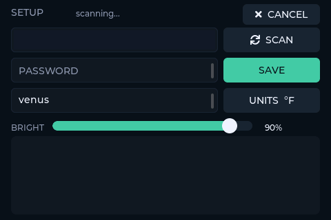
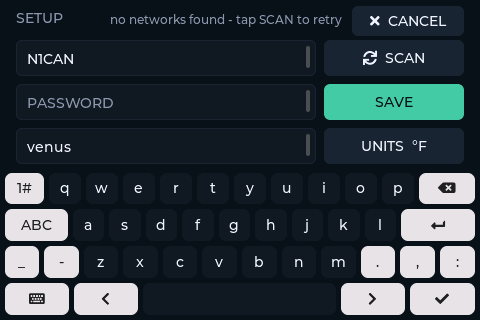
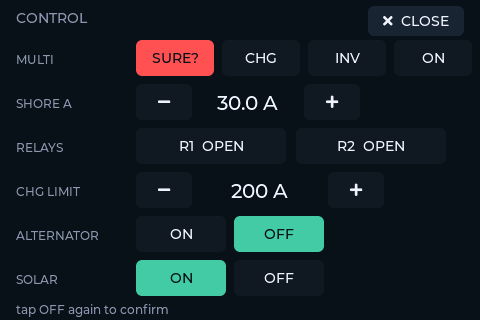

# Darkside PWR — User Guide

A glanceable Victron power monitor for the truck. It polls the GX device
over the local network once a second and shows the house battery, charge
sources, loads, temperatures, and LPG tanks on one screen. Everything is
touch-configurable — no computer needed after the first flash.

## The power screen


| Element | Meaning |
|---|---|
| **Arc + big %** | House battery state of charge, with `CHARGING` / `DISCHARGING` / `IDLE` beneath it |
| **HOUSE** | Battery voltage |
| **CURRENT** | Battery current — positive charging, negative discharging |
| **POWER IN** | Total charge input: solar + alternator (Orion XS) combined |
| **AC LOADS** | AC consumption from the inverter |
| **Temps line** | One reading per configured temperature sensor, in °F or °C (setup screen) |
| **Tanks line** | LPG levels; a level turns **red** below 20 % |
| **Power line** | The balance: `PV` solar in, `ALT` alternator in, `DC` DC loads, `NET` battery flow (`+` = charging) |
| **Bolt (lower right)** | Opens the CONTROL page |
| **Gear (lower right)** | Opens the setup screen |
| **Dot (upper right)** | Link status — see below |

**Link dot:** red = no Wi-Fi · amber = Wi-Fi up but no GX data for 10+
seconds · green = live. Brief reconnects don't blink the dot; it only goes
amber when data is genuinely stale.

**`--` values:** a sensor that didn't answer shows `--` instead of a stale
number. Ruuvi tags nap between broadcasts and a dead sensor drops off
entirely (as `ELIJAH --` in the screenshot — its Mopeka battery died); both
self-heal when the sensor returns. The alternator shows `0 W` when the
engine is off.

**Title (upper left):** set by `UI_TITLE` in `config.h`, or — when that is
left `""` — pulled automatically from the GX system name (needs a Venus
release newer than 3.75; until then the default `PWR MONITOR` shows).

## The setup screen

Tap the gear. A network scan starts immediately.





**Wi-Fi:** tap a network in the list (strongest first, top 12) — the
keyboard opens straight onto the password field. Type it, hit the ✓ key,
then **SAVE**. Open networks: leave the password empty. The panel joins
immediately; watch the dot on the power screen go green. Credentials stick
across reboots and reflashes.

**GX ADDRESS:** where to find the Victron GX — an mDNS hostname (`venus`,
with or without `.local`) or a plain IP (`10.20.30.239`). Clearing the
field reverts to the `config.h` default. When a custom address is set the
compiled-in fallback IP is deliberately ignored, so a typo fails visibly
instead of silently polling the wrong box.

**UNITS °F/°C:** flips the temperature unit. Applies on the next sample
(about a second) and persists.

**BRIGHT:** backlight slider — live while dragging, saved when released,
floored at 10 % so the screen can never dim to black.

**SAVE vs CANCEL:** SAVE applies only what you changed — opening the screen
and saving without touching Wi-Fi can never wipe a stored password. CANCEL
discards Wi-Fi/GX edits; units and brightness apply the moment you touch
them and are not undone by CANCEL.

**What persists:** Wi-Fi credentials, GX address, units, and brightness all
live in flash (NVS) and survive reflashes. `config.h`/`secrets.h` values
are only the first-boot defaults. `esptool erase-flash` resets everything.

## Telemetry (USB serial)

Plug into the USB-C port and open the serial port at 115200 with **default
DTR/RTS** (pyserial defaults are fine; forcing them low reboots the panel
into the bootloader — screen goes black until reset). One line per sample:

```
[gx] soc=85% 13.40V +0.3A +4W pv=33W alt=0W ac=9W dc=7W st=0 t=74.9/75.4/79.1F lpg=99/-1/100% mp=3 sh=30.0 r1=0 r2=0 chg=200 am=1 poll=2207ms
```

`st` battery state (0 idle, 1 charging, 2 discharging) · `t=` temperatures
in configured units (`-99.0` = sensor not answering) · `lpg=` tank percents
(`-1` = not answering) · `mp=` MultiPlus mode, `sh=` shore limit, `r1=`/`r2=`
relays, `chg=` DVCC charge limit, `am=` alternator mode (`-` = register
didn't answer) · `poll=` how long the poll took on the network task
(a GX link-health signal — tens of ms on a healthy LAN). Every 10 s the
firmware also prints `[ui] max loop gap NNNms`; single-to-double digits
means the touchscreen is responsive.

## The control page

The bolt button (next to the gear) opens CONTROL — write access to the
Victron system over the same local Modbus connection:


- **MULTI** — MultiPlus mode: `OFF` / `CHG` (charger only) / `INV`
  (inverter only) / `ON`. **OFF kills your AC loads**, so it asks for a
  second confirming tap within 3 seconds:

  
- **SHORE A** — the AC input current limit, in 5 A steps (5–50 A). Note a
  Digital Multi Control or BMS can own this setting, in which case the GX
  will snap it back.
- **RELAYS** — the GX's two relay outputs. They only respond if the relay
  function is set to *Manual* on the GX (Settings → Relay).
- **CHG LIMIT** — DVCC maximum charge current for the whole system, 10 A
  steps, up past 100 A to `NO LIMIT`.
- **ALTERNATOR** — Orion XS on/off (works on Venus 3.75, verified live).
  On older GX firmware lacking the register, the row says so and stays
  inert.
- **SOLAR** — SmartSolar MPPT charger on/off. Note: on a DVCC/BMS-managed
  system the charger is under external control, so the GX may override the
  setting — the read-back highlight shows whether it stuck.

Every control shows the **GX's own reported state**, refreshed every
second — not what was last tapped. If a write is rejected or overridden,
the highlight simply doesn't move (or snaps back), so the truth is always
on screen. Commands queued while the GX is unreachable expire after 10
seconds instead of firing late. All writes are logged to telemetry as
`[ctl] write ...`.

## Charge-complete chirps

When a real charging session (30+ seconds of `CHARGING`) ends with the
battery at 99–100 %, the panel sounds a quick double chirp on its piezo
buzzer — once per charge session. Charging that stops early (load exceeded
the charger, clouds) stays silent.

Debug commands (type into the serial terminal): `S` dumps a screenshot of
the current screen as hex (decode with `tools/capture_screenshot.py`),
`U` opens the setup screen, `C` opens the control page, `B` plays the
charge-complete chirps, `V` sweeps Modbus unit ids to find your MultiPlus
and solar charger units (`GX_VEBUS_UNIT`/`GX_SOLAR_UNIT`), `K` opens setup with the keyboard
up and `D` arms the MULTI OFF confirm (both exist for capturing the
screenshots in these guides), `M` prints memory watermarks.
